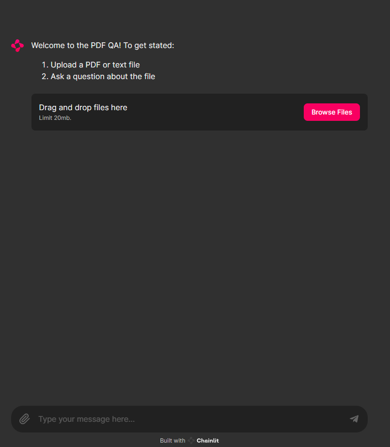

# LLM Chatbot with RAG
This project uses Vicuna to build a Retrieval-Augmented Generation (RAG) chatbot using Chainlit for the interface. By processing the provided document, the chatbot can now answer questions, which is relevant to this file.

### How to run

1. Open `chainlit.ipynb` on Google Colab

2. Update the authtoken in the notebook by logging into [ngrok](https://ngrok.com/) and choose `Your Authtoken`
```
!ngrok config add-authtoken #your_auth_token
```

3. Run all the cells and open the public URL to access the chatbot
```
public_url = ngrok.connect(8000).public_url
print(public_url)
```

### Demo
<p align='center'>
    